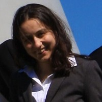

# About Me

  

    
  

  

    <ul style="list-style: none; padding-left: 0;">
      <li>
        <a href="https://twitter.com/fkariminejadasl" target="_blank" style="text-decoration: none; color: inherit;">
           Twitter
        </a>
      </li>
      <li>
        <a href="https://www.linkedin.com/in/fkariminejadasl" target="_blank" style="text-decoration: none; color: inherit;">
           LinkedIn
        </a>
      </li>
      <li>
        <a href="https://github.com/fkariminejadasl" target="_blank" style="text-decoration: none; color: inherit;">
           GitHub
        </a>
      </li>
      <li>
        <a href="https://scholar.google.com/citations?user=MIKTj4AAAAAJ&hl=en" target="_blank" style="text-decoration: none; color: inherit;">
           Google Scholar
        </a>
      </li>
    </ul>
  

### ML & CV Research Engineer, University of Amsterdam, Oct 2022

My projects address diverse ecological challenges, including fish tracking from video data and bird behavior classification using GPS/IMU time series data. I also supervise BSc, MSc, and PhD students in computer science, focusing primarily on ecological applications.

- In the video-based fish tracking project, I tackle the problem of Multi-Camera Multi-Object Tracking (MOT). I have developed various deep learning-based and traditional algorithms for detection, tracking, and 3D reconstruction.
- For bird behavior classification, I created the MAE pretraining and fine-tuning algorithm and pipeline.

### Autonomous Driving R&D Engineer & tech lead, TomTom May 2018, Aug 2022

HD Map making from LiDAR data, HD map change detection and HD map quality estmation With Deep learning and probabilistic machine learning
Somewhere between July 2020 till June 2021, I became a tech lead.

### R&D Computer Vision Engineer, Robot Care Systems bv, Nov 2016 - Apr 2018

Working on self-driving car (Autonomous driving) using computer vision via deep learning

### R&D Computer Vision Engineer, Fugro Dec 2011 - May 2016

Research and development of offshore vision systems for camera-based positioning and mapping

- Real-time camera-based jacket motion estimation (3Direct)
- Real-time camera-based inclination measurement (InclinoCam)
- Laser and camera-based 3D reconstruction (profiling) for underwater pipe surveys (SeaStriper)
- Camera-based metric 3D reconstruction of underwater structures 
- Underwater camera calibration

### Postdoctoral Researcher, Leiden University Medical Center, Aug 2009 - Sep 2011

Developing algorithms for macromolecular structural determination from single particle cryo-electron microscopy; CTF simulation and parameter estimation; radiation damage studies; analyses of stroboscopic data (image series): nonrigid registration and CTF parameter estimation; segmentation of microtubules from electron tomograms

### Delft University of Technology, PhD Researcher, Dec 2004 - Jun 2009 

Developing algorithms for Image-sequence registration of data collected from hovering helicopter, background/foreground identification, vehicle detection, vehicle tracking

